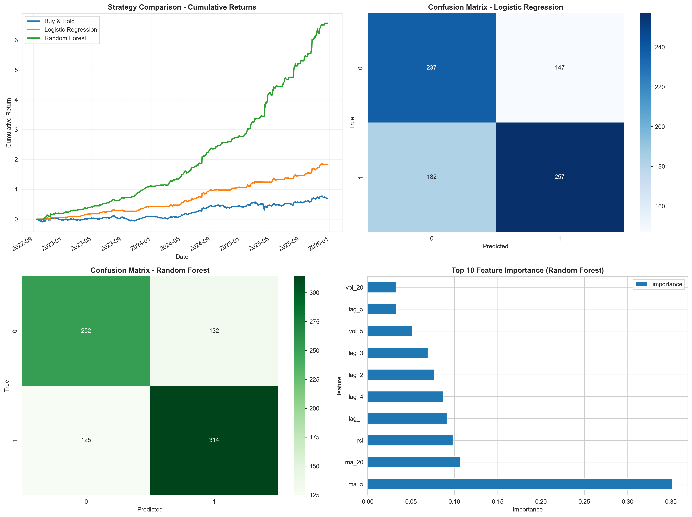
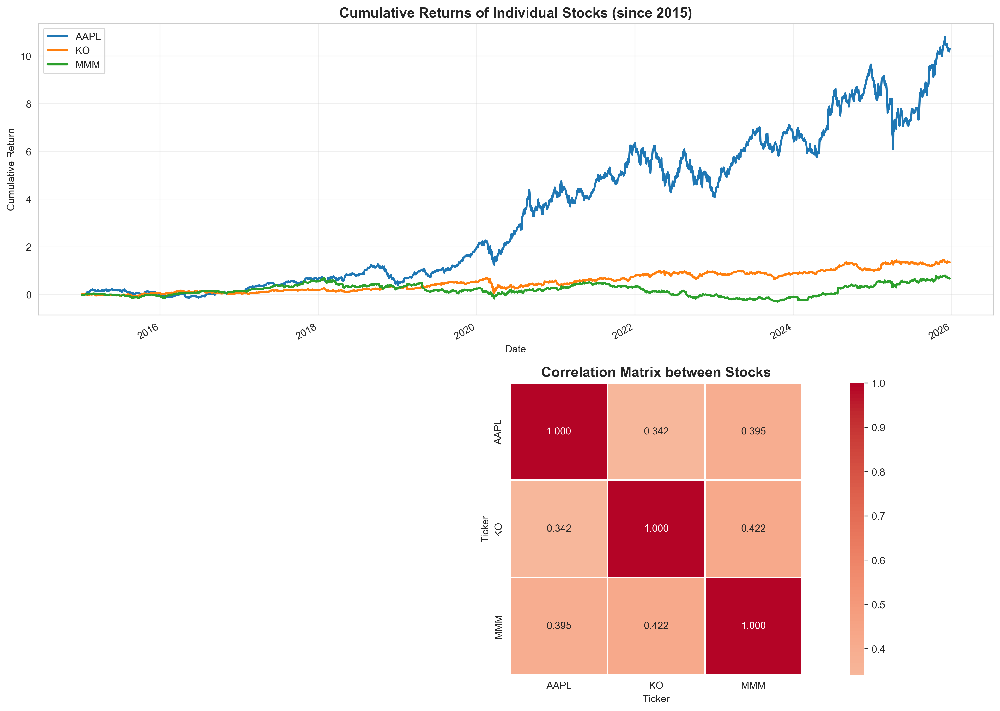

# 🧠 Optimal Portfolio Optimization with Machine Learning

This project combines Modern Portfolio Theory with Machine Learning to analyze stock portfolios and develop predictive trading strategies. 
The analysis is divided into four main sections: individual stock analysis, portfolio optimization through the efficient frontier, machine learning-based market direction prediction, and backtesting of ML-driven trading strategies.
The project demonstrates how to construct an optimal portfolio using traditional finance methods and then applies machine learning algorithms to predict market movements and improve trading decisions.

---

## 📈 Objectives

- The analysis follows a systematic approach:

1) **Individual Stock Analysis** - Historical performance and correlation analysis
2) **Portfolio Optimization** - Efficient frontier construction and optimal portfolio selection
3) **Machine Learning Models** - Market direction prediction using classification algorithms
4) **Backtesting** - Performance evaluation of ML-based trading strategies


## 📊 Dataset 
Assets analyzed:

- **AAPL** (Apple Inc.)
- **MMM** (3M Company)
- **KO** (The Coca-Cola Company)

Data is downloaded from January 1, 2015, using `yfinance` library, which retrieves adjusted closing price from Yahoo Finance 


---

## 🚀 Getting Started

### Part 1: Individual Stock Analysis

This section analyzes each stock individually to understand their historical performance and relationships.

Key metrics calculated:

- **Annual Return**: Average yearly return of the stock
- **Annual Volatility**: Standard deviation of returns (measure of risk)
- **Sharpe Ratio**: Risk-adjusted return metric (higher is better)
- **Sortino Ratio**: Similar to Sharpe but penalizes only downside volatility
- **Maximum Drawdown**: Largest peak-to-trough decline (worst loss period)
- **Total Return**: Cumulative return over the entire period

### Part 2: Portfolio Optimization - Efficient Frontier

This section implements **Modern Portfolio Theory** to find the optimal mix of assets that maximizes returns for a given level of risk.

Process:

1) **Random Portfolio Generation**: Creates 5,000 random portfolios with different weight combinatios;

- Each portfolio has weights that sum to 100%
- For each portfoloio, calculates:
   - **Annalized Return**: Expected yearly return based on historical data
   - **Annalized Risk** (volatility): Standard deviation of portfolio returns
   - **Sharpe Ratio** (Return -Risk-free rate) / Risk

- **Optimal Portfolio Identification**:
   - **Maximum Sharpe Ratio Portfolio**: Best risk-adjusted returns (most efficient)
   - **Minimum Variance Portfolio**: Lowest possible risk (most conservative)

The **Efficient Frontier** is the set of optimal portfolios that offer the highest expected return for a defined level of risk. Portfolio below this curve are sub-optimal.

### Part 3: Machine Learning - Market Direction Prediction

This section uses machine learning to predict whether the market will go **up** or **down** the next day, enabling more intelligent trading decisions.

**Step 1: Feature Engineering**
Creates an equally-weighted portfolio (33.33% in each stock) and generates predictive features:

- **Lagged Returns** (lag_1 to lag_5): Past 5 days of returns
- **Moving Averages** (ma_5, ma_20): Short and long-term trend indicators
- **Rolling Volatility** (vol_5, vol_20): Recent market turbulence measures
- **RSI** (Relative Strength Index): Momentum indicator (0-100 scale)

**Step 2: Target Variable**
The target is binary:

- **1 (Up)**: Next day return is positive
- **0 (Down)**: Next day return is negative or zero

**Step 3: Train/Test Split**

- **70% training data**: Used to teach the models
- **30% test data**: Used to evaluate real-world performance
- **Time-series split**: Maintains temporal order (no shuffle) to prevent data leakage


##  🤖 Machine Learning Models


**Model 1: Logistic Regression**

A statistical model that predicts probabilities of binary outcomes.

**How it works**:

Finds a linear relationship between features and the probability of the market going up; it uses a sigmoid function to output probabilities between 0 and 1 and it is simple, fast and interpretable.


**When to use**:

- When you want a baseline model
- When interpretability is important
- When you have limited data

**Model 2: Random Forest**

An ensemble of decision trees that votes on the final prediction.

**How it works**:

Builds 100 decision trees, each trained on a random subset of data; each tree makes a prediction, and the majority vote wins. it can capture complex non-linear patterns and it provides feature importance rankings.

**When to use**:

- When you have enough data
- When relationships between features are complex
- When you want robust predictions


## Model Evaluation
Both models are evaluated using:

- **Accuracy**: Percentage of correct predictions
- **Precision**: Of the "Up" predictions, how many were correct?
- **Recall**: Of actual "Up" days, how many were predicted?
- **F1-Score**: Harmonic mean of precision and recall
- **Confusion Matrix**: Visual breakdown of correct and incorrect predictions

### Part 4: Backtesting - Trading Strategy PErformance

Tests how the ML models would have performed in real trading scenarios using historical data.

**Trading Logic**:
Simple strategy for both models:

- **If prediction** = 1 (Up): Buy and hold for the day (capture the return)
- **If prediction** = 0 (Down): Stay in cash (avoid the loss)

**Strategies compared**:

- **Buy & Hold**: Traditional strategy - always invested in the equally-weighted portfolio
- **Logistic Regression Strategy**: Only invest when LR model predicts "Up"
- **Random Forest Strategy**: Only invest when RF model predicts "Up"

## Key Insights

The backtesting reveals:

- Whether ML models can outperform simple buy-and-hold
- Which model is more reliable for trading decisions 
- Risk-return trade-offs of active vs passive strategies
- When models fail and why (through confusion matrices)

## 📁 Project Structure

```
├── opt_portfolio.py              # Main script where it's stored and computed the optimization process
├── yfinance_change:2025.py              # Code that remembers the changes of the last year (main in pandas visualization)
├── images/                 # Visualization outputs and results
│   ├── efficient_frontier.png
│   ├── ml_results.png
│   ├── performance_drawdown.png
│   └── stock_analysis.png
└── README.md

```
### Prerequisites

Make sure you have Python 3.11+ installed on your system.

### Installation

1. **Clone the repository**
   ```bash
   git clone https://github.com/saragiuli/Investment_Portfolio_Optimization.git
   cd Investment_Portfolio_Optimization
   ```

2. **Install required dependencies**
   ```bash
   pip install -r requirements.txt
   ```


### Running the Project

1. **Run the main analysis script**
   ```bash
   python opt_portfolio.py
   ```

3. **View results**: Check the `images/` folder for generated visualizations. 

The visualization contains:

- `stock_analysis.png` - Individual stock performance and correlation
- `efficient_frontier.png` - 5,000 random portfolios and optimal selections
- `ml_results.png` - ML model predictions and feature importance
- `performance_drawdown.png` - Strategy comparison and risk analysis

The last image contains: 

1. **Cumulative Returns Chart**: Shows how $1 invested grows over time for each strategy
2. **Confusion Matrices**: Visual breakdown of model prediction accuracy
3. **Feature Importance**: Which indicators matter most for predictions
4. **Drawdown Chart**: Shows the worst periods for each strategy

---

## 📊 Features

- **Asset Selection**: Automated selection of assets based on historical performance
- **Risk-Return Analysis**: Calculate Sharpe ratio, volatility, and expected returns
- **Efficient Frontier**: Visualize optimal portfolios across different risk levels
- **ML Models**: Implement predictive models for asset performance
- **Backtesting**: Test portfolio strategies on historical data

---

## ⚙️ Technologies Used

- **Python** 🐍 - Core programming language
- **Pandas & NumPy** - Data manipulation and numerical computing
- **Scikit-learn** - Machine learning algorithms
- **Matplotlib / Plotly** - Data visualization
- **YFinance** - Financial data retrieval

---

## 📸 Sample Results

Portfolio Efficient Frontier


Main results of Risk-Return analysis


Stock analysis


---

## 🤝 Contributing

Feel free to fork this project and submit pull requests. For major changes, please open an issue first to discuss what you would like to change.

---


## 👤 Author

**Sara Giuli**
- GitHub: [@saragiuli](https://github.com/saragiuli)

---

## 📚 References

This project was inspired by the course "Python for Finance and Data Science" by Instructor Jose Portilla on Udemy.
Link: https://www.udemy.com/course/python-for-finance-and-data-science/
